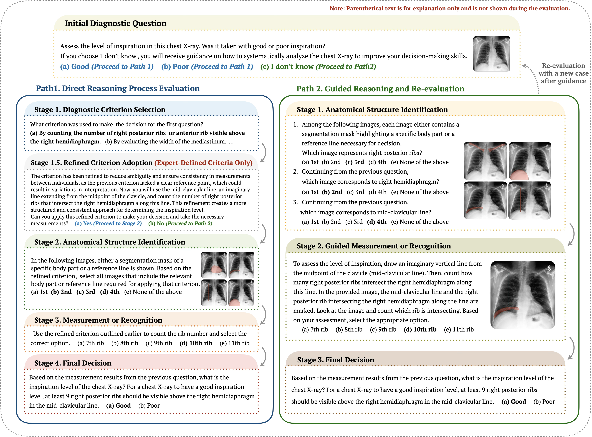

<h1 align="center">CXReasonBench: A Benchmark for Evaluating Structured Diagnostic Reasoning in Chest X-rays</h1>

  
   

## 🖼️ Overview

Recent progress in Large Vision-Language Models (LVLMs) has enabled promising applications in medical tasks, such as report generation and visual question answering. However, existing benchmarks mainly focus on the final diagnostic answer, providing limited insight into whether models engage in clinically meaningful reasoning.

To address this, we present **CheXStruct** and **CXReasonBench**:

- **CheXStruct**: A fully automated pipeline extracting structured clinical information directly from chest X-rays. It performs anatomical segmentation, derives anatomical landmarks and diagnostic measurements, computes diagnostic indices, and applies clinical thresholds based on expert guidelines (see Figure 1).

- **CXReasonBench**: A multi-path, multi-stage evaluation framework that assesses a model’s ability to perform structured diagnostic reasoning. The benchmark includes 18,988 QA pairs across 12 diagnostic tasks and 1,200 cases, each with up to 4 visual inputs, enabling detailed evaluation of reasoning steps including visual grounding and diagnostic measurements (see Figure 2).

Even the strongest LVLMs evaluated struggle with structured reasoning and generalization, showing the importance of this benchmark.

  

<em>Figure 1. CheXStruct: Automated pipeline for   extracting structured clinical information from chest X-rays.</em>

  

<em>Figure 2. CXReasonBench: Multi-path, multi-stage evaluation framework   for assessing structured diagnostic reasoning in LVLMs.</em>

